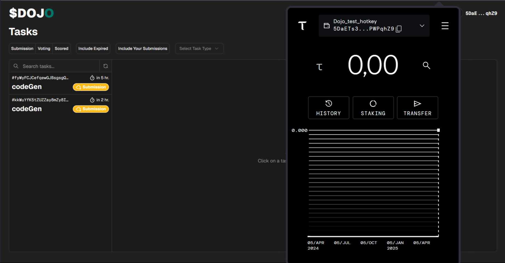

# How to connect your wallet to the Dojo platform?

In order to connect your wallet to the Dojo platform, you will need a browser extension of the crypto wallet, for example, "Bittensor":

<figure><figcaption></figcaption></figure>

or "Talisman":

<figure><figcaption></figcaption></figure>

\
To connect your browser to the platform via a cryptographic wallet, you need to import the hot key into your browser cryptographic wallet. &#x20;

<figure><figcaption></figcaption></figure>

And then connect to the Dojo platform using this hotkey.

<figure><figcaption></figcaption></figure>

\
Usually, you can only have cold keys in your wallet. But you can also import your hot keys into it.\
\
<mark style="color:$success;">**To do this, you will need a seed phrase from a hot key.**</mark>\
\
To create a hotkey and a seed phrase for it, you will need `btcli`, the Bittensor command line interface.

<figure><figcaption></figcaption></figure>

<mark style="color:$danger;">Its installation and use is described in detail</mark> [<mark style="color:blue;">**here**</mark> ](https://docs.learnbittensor.org/getting-started/install-btcli)<mark style="color:$danger;">in the official documentation of Bittensor.</mark>\
\
The most convenient way to work with Dojo is to install and use btcli locally on your PC. You don't need to run a separate VPS/VDS. You can work as a miner or contributor locally on your PC, without having to connect to the Dojo subnet 24/7. You only need to connect to the Dojo platform when you're working and completing tasks.

<mark style="color:$success;">The platform is all you need to work with assignments.</mark>

<figure><figcaption></figcaption></figure>

\
Below is a short step-by-step guide on how you can create and import a hotkey into your wallet:

1. Install \`btcli' — the Bittensor command line interface. It is described in detail about its installation and use here in the official Bittensor documentation:\
   \
   `pip install bittensor-cli`\

2.  Create a new cold key (or use your existing cold key):\
    \
    `btcli wallet new-coldkey`ey\

    <figure><figcaption></figcaption></figure>

    \

3.  Create a hotkey:\
    \
    `btcli wallet new-hotkey`\

    <figure><figcaption></figcaption></figure>

    \

4.  Save the hotkey seed phrase:\

    <figure><figcaption></figcaption></figure>

    \

5.  Import a new wallet in your browser wallet using the hot key seed phrase:\

    <figure><figcaption></figcaption></figure>

    \

6.  Connect to the platform by selecting your hotkey.\

    <figure><figcaption></figcaption></figure>

    \

7.  After successful connection, everything should look like this and the tasks should be displayed immediately:\

    <figure><figcaption></figcaption></figure>
